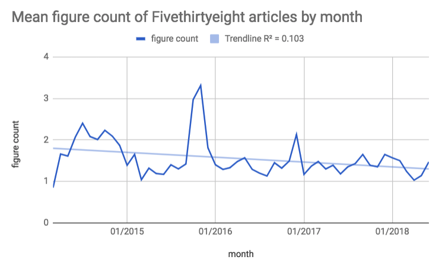

# FiveThirtyEight Analysis

I have been a regular reader of [FiveThirtyEight](http://fivethirtyeight.com) since it's relaunch under ESPN in March 2014. I was drawn to their style of journalism that combined data analytics with the subjects I was interested in - namely politics, economics, and sports. In the beginning I read every word of every article on the site. However, as time went on and the site grew I found that I could no longer keep up with their daily content. I began to skip articles, and eventually found myself skimming those that I did read. I recently realized that I do not enjoy my reading of FiveThirtyEight in the way that I originally did. 

I have a theory about why I don't enjoy FiveThirtyEight's articles as much as I once did: the articles are too long and less data-driven. I dislike having to read long articles that have few tables, graphics, etc. that help explain the data. If this hypothesis is true, then FiveThirtyEight has become more like other news outlets instead of a source of data journalism.

In a true FiveThirtyEight fashion, I decided to analyze data scraped from their website. The code provided here shows how I scraped and analyzed all articles from http://fivethirtyeight.com since it's official launch on March 17, 2014. You can run this code yourself to verify my results, and you may alter my choices to better match FiveThirtyEight's website.

## Results

My findings suggest that my theory about FiveThirtyEight may be justified. As you can see in the below chart displaying monthly average word count, there is a clear upward trend in the length of FiveThirtyEight's articles. The trendline (with an r-squared coefficient of .376) moves from around 850 in March 2014 to almost 1100 in June 2018. Put another way, the average of the monthly word count averages for the first year of FiveThirtyEight's publication was 883.7, whereas it was 1025.3 in the most recent year. That is an increase of 16% in article length since the first year of publication.


I also analyzed the occurrences of charts and figures in FiveThirtyEight's articles, as that is my favorite aspect of their data journalism. In the below chart displaying monthly average figure count we can see a negative trendline with an r-squared coefficient of .1 (admittedly not a strong correlation). In the first year of publication the average of the monthly figure count averages was 1.83, while for the most recent year it was 1.37. That is a decline of 24.8% since the first year of publication.



This analysis shows that, while slight, there has been an increase in article length with a simultaneous decrease in the use of figures and charts. In my opinion, that shows that FiveThirtyEight has moved away from their data journalism ideals. There is more traditional writing and less usage of charts and figures across their articles. An example of this would be the FiveThirtyEight [weekly slack chat](https://fivethirtyeight.com/tag/slack-chat/), an article that is mostly just a log of a slack chat between political writers rather than a data-driven article. I'm not very interested in reading articles like these, whereas in the first year of publication I read every article on FiveThirtyEight. Now I have a data-driven explanation for why FiveThirtyEight has become less interesting.

## How to run

Prerequisites: 
* [Node.js](https://nodejs.org/en/)
* [nvm](https://github.com/creationix/nvm)


```sh
$ nvm install
$ npm install
$ npm start
```

This will output all article information into a JSON object in a `results.json` file. It will then analyze those articles and output the analysis to `results.csv`. 

You can modify the selectors (html element and class) used to scrape articles in `config.js`.
